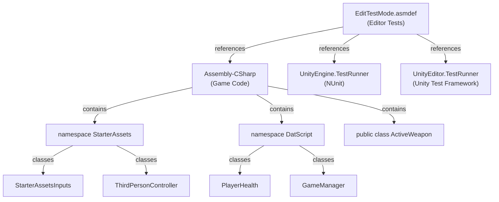

# ✅ Checklist Cấu Hình Assembly Definition

## 🎯 Các Bước Đã Hoàn Thành

### 1. **File EditTestMode.asmdef**
- [x] Tạo file trong: `Assets/TestAutomationScripts/Editor/EditTestMode.asmdef`
- [x] Cấu hình `name`: `"EditTestMode"`
- [x] Cấu hình `rootNamespace`: `"EditModeTests"`
- [x] Thêm references bắt buộc:
  - [x] `"UnityEngine.TestRunner"` (NUnit Framework)
  - [x] `"UnityEditor.TestRunner"` (Unity Test Runner)
  - [x] `"Assembly-CSharp"` ⭐ **RẤT QUAN TRỌNG**
- [x] Thêm `optionalUnityReferences`: `["TestAssemblies"]`
- [x] Set `includePlatforms`: `["Editor"]` (Chỉ compile trong Editor)

---

## 📂 Cấu Trúc Thư Mục Hiện Tại

```
Assets/TestAutomationScripts/
├── Editor/
│   ├── 📄 EditTestMode.asmdef             ← ✅ ĐÃ TẠO
│   ├── 📄 EditTestMode.asmdef.meta        ← ✅ TỰ ĐỘNG SINH
│   ├── 📄 PlayerHealthTest.cs              ← Sẵn có
│   ├── 📄 PlayerMovementTest.cs            ← Sẵn có
│   └── 📄 WeaponTest.cs                    ← Sẵn có
│
├── PlayTestMode/
│   ├── 📄 PlayTestMode.asmdef              ← Sẵn có
│   └── (play mode test files)
│
└── 📄 ASSEMBLY_SETUP_GUIDE.md              ← ✅ HƯỚNG DẪN
```

---

## 🔍 Xác Minh Configuration

### **Mở file `EditTestMode.asmdef` và kiểm tra:**

```json
{
    "name": "EditTestMode",                         ✓ Correct
    "rootNamespace": "EditModeTests",              ✓ Correct
    "references": [
        "UnityEngine.TestRunner",                  ✓ Correct
        "UnityEditor.TestRunner",                  ✓ Correct
        "Assembly-CSharp"                          ✓ Correct (Critical!)
    ],
    "optionalUnityReferences": [
        "TestAssemblies"                           ✓ Correct
    ],
    "includePlatforms": [
        "Editor"                                   ✓ Correct
    ],
    "excludePlatforms": [],
    "allowUnsafeCode": false,
    "overrideReferences": false,
    "precompiledReferences": []
}
```

---

## 🧪 Kiểm Tra Tests Hoạt Động

### **Bước 1: Mở Test Runner**
```
Menu: Window → General → Test Runner
```

### **Bước 2: Chọn Tab "EditMode"**
- Nếu lần đầu, Unity sẽ scan project (~10-30 giây)
- Bạn sẽ thấy ba test classes:
  - `EditModeTests.PlayerHealthTest`
  - `EditModeTests.PlayerMovementTest`
  - `EditModeTests.WeaponTest`

### **Bước 3: Run Tests**
```
Button: "Run All" (chạy tất cả)
hoặc
Chọn test riêng → Run
```

### **Expected Results (✅ Success):**
```
✓ PlayerHealthTest (4 tests passed)
✓ PlayerMovementTest (4 tests passed)
✓ WeaponTest (4 tests passed)
────────────────────────
Total: 12 tests PASSED
```

---

## ⚠️ Troubleshooting

### **Vấn Đề 1: "Could not load type 'DatScript.PlayerHealth'"**

**Nguyên Nhân:** `"Assembly-CSharp"` không có trong `references`

**Giải Pháp:**
```json
"references": [
    "UnityEngine.TestRunner",
    "UnityEditor.TestRunner",
    "Assembly-CSharp"  ← Thêm dòng này!
]
```

---

### **Vấn Đề 2: Tests Không Hiện Trong Test Runner**

**Nguyên Nhân:** .asmdef chưa được Unity nhận dạng

**Giải Pháp:**
1. Đóng Unity hoàn toàn
2. Xóa thư mục `Library/` trong project
3. Mở lại Unity
4. Đợi compile xong (~1-2 phút)

---

### **Vấn Đề 3: "NullReferenceException" Khi Chạy Test**

**Nguyên Nhân:** Test không thể truy cập class từ Assembly-CSharp

**Giải Pháp:**
- Kiểm tra lại danh sách `references` 
- Xác nhận class được khai báo `public`
- Reload project (Ctrl+Shift+F5)

---

### **Vấn Đề 4: Project Không Compile**

**Nguyên Nhân:** Syntax error trong .asmdef (JSON không hợp lệ)

**Giải Pháp:**
1. Mở file `.asmdef` bằng text editor
2. Sử dụng JSON validator: https://jsonlint.com/
3. Kiểm tra dấu phẩy, dấu ngoặc

---

## 📋 Các Tests Sẵn Có

### **PlayerHealthTest.cs** (4 tests)
- ✓ `TestTakeDamageReducesHealth`
- ✓ `TestTakeDamageBelowZeroTriggersDeathStateAndClampsHealth`
- ✓ `TestHealIncreasesHealthButRestrictsToMax`
- ✓ `TestResetHealthRestoresComponentsAndHealth`

### **PlayerMovementTest.cs** (4 tests)
- ✓ `TestDefaultMovementValues`
- ✓ `TestSetSensitivity`
- ✓ `TestPrivateTerminalVelocityUsingReflection`
- ✓ `TestAddRecoilUpdatesPitchAndYaw`

### **WeaponTest.cs** (4 tests)
- ✓ `TestWeaponCanReloadCondition`
- ✓ `TestStartReloadUpdatesWeaponState`
- ✓ `TestRefillAmmoUpdatesAmmoMathAndRestoresState`
- ✓ `TestStartFiringShouldBeBlockedWhenEmptyOrReloading`

---

## 🎓 Hiểu Rõ Cấu Trúc



---

## ✨ Final Status

✅ **EditTestMode.asmdef** - Đã tạo với cấu hình đúng
✅ **References** - Đã thêm Assembly-CSharp
✅ **Test Files** - Sẵn sàng để chạy
✅ **Documentation** - Hướng dẫn chi tiết

**Bạn có thể bắt đầu chạy tests ngay bây giờ!**

---

**Ngày Cập Nhật:** April 9, 2026
**Version:** 1.0
**Status:** ✅ Ready

